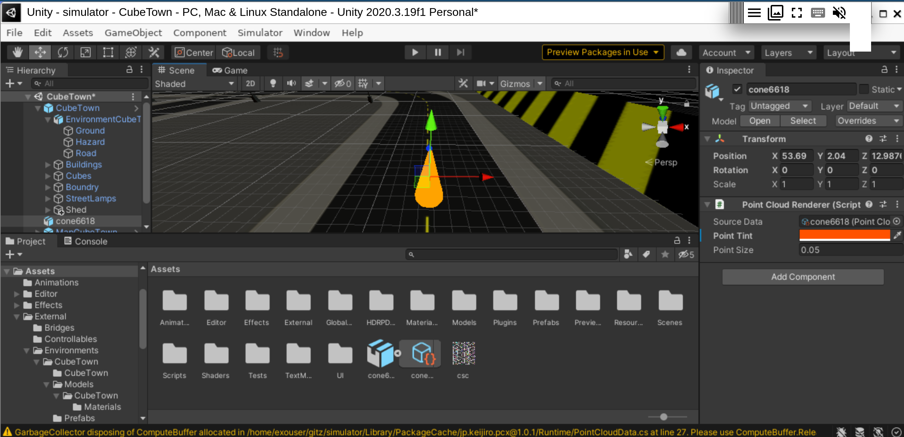
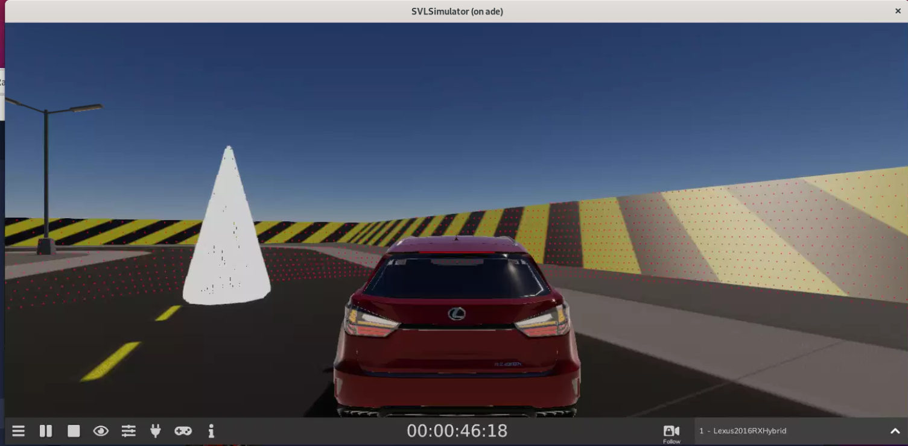

# 465FinalProject

My first contribution was to build a map that could be used in svl simulator that included our malicious object. To do this, I cloned the source code for svl simulator, then loaded the project in Unity. Next I downloaded the cubetown map and loaded it's assets into Unity. Finally, I added our malicious object (the cone) to the map, gave it physical properties, and then used the unity build tools to compile a new map.

Next, I loaded our custom map with the cone into svl simulator. Then I created a new simulation with this map and drove around to test that the map and physics worked as expected. 
