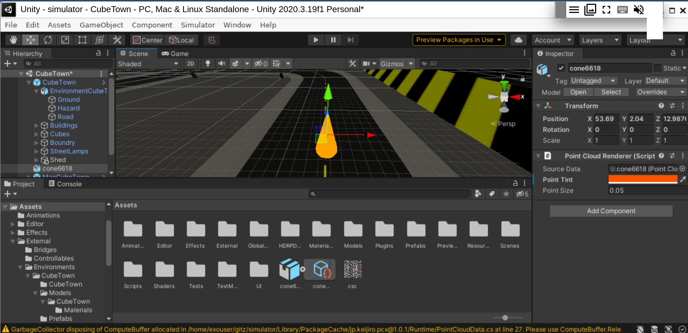
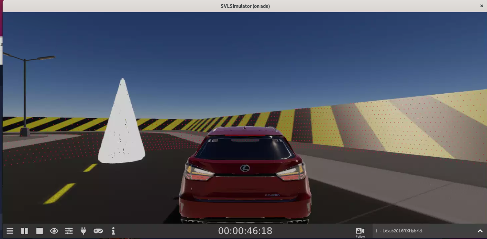
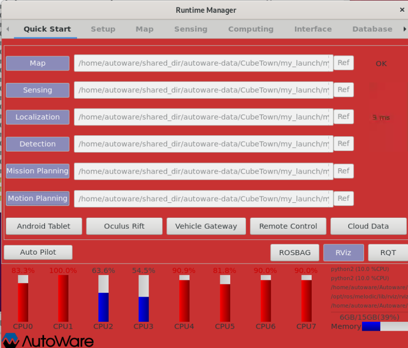
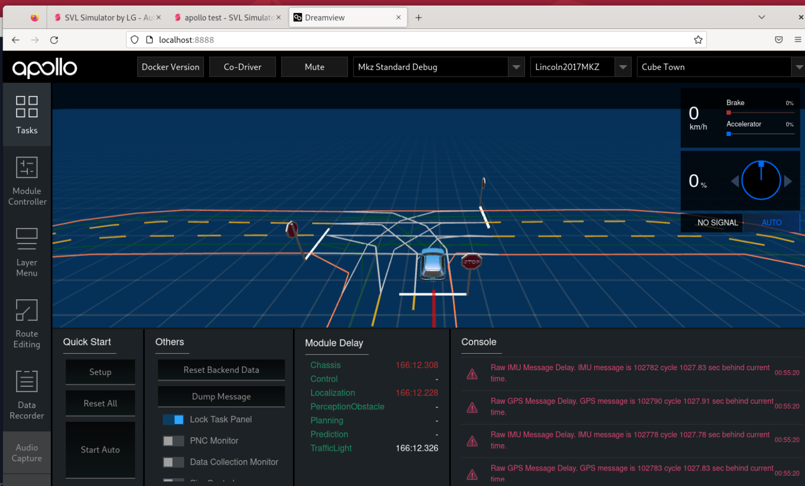
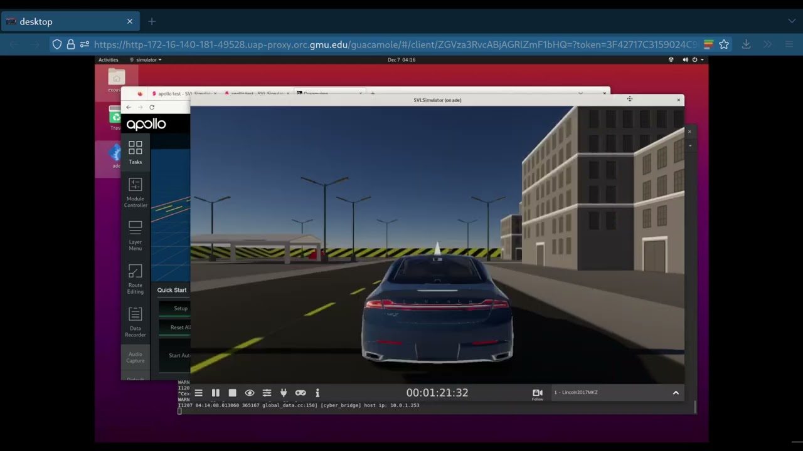
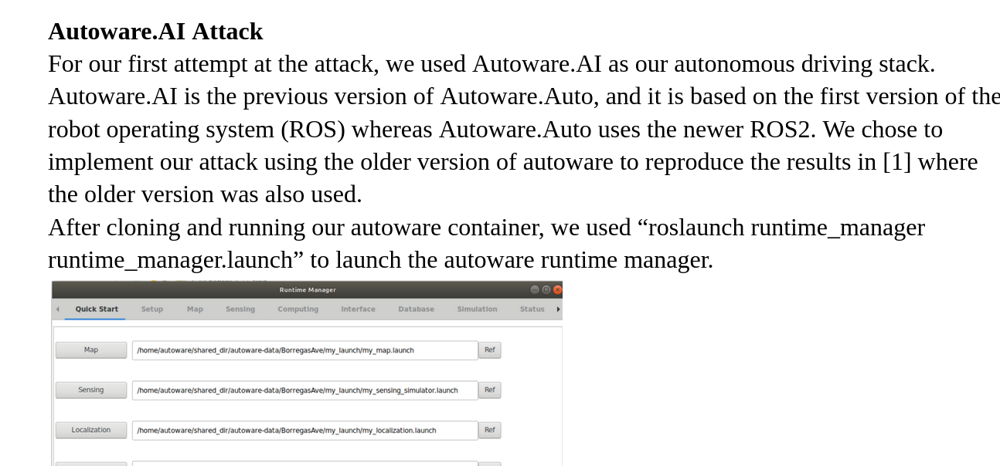
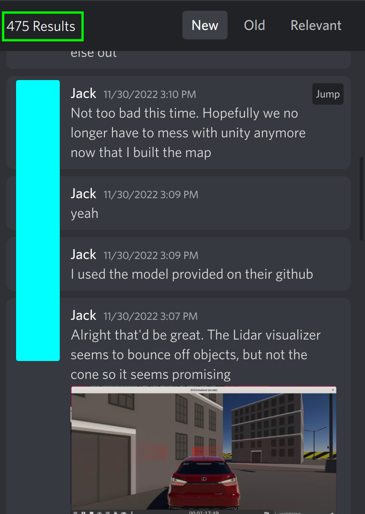

# 465FinalProject

My first contribution was to build a map that could be used in svl simulator that included our malicious object. To do this, I cloned the source code for svl simulator, then loaded the project in Unity. Next I downloaded the cubetown map and loaded it's assets into Unity. Finally, I added our malicious object (the cone) to the map, gave it physical properties, and then used the unity build tools to compile a new map.

Next, I loaded our custom map with the cone into svl simulator. Then I created a new simulation with this map and drove around to test that the map and physics worked as expected. 

I was also instrumental to the autoware attack setup and testing.

As well as the attack setup and testing for baidu apollo.

Click [here](https://www.youtube.com/watch?v=Gq4KYq3EPdY) to watch my video demostration of our issues with the apollo av stack.

In the report, I wrote the section about the Autoware.AI attack and the section about the attack prerequisites. 

As you can see, I was also a very active contributer to the discussions in our discord server. 

